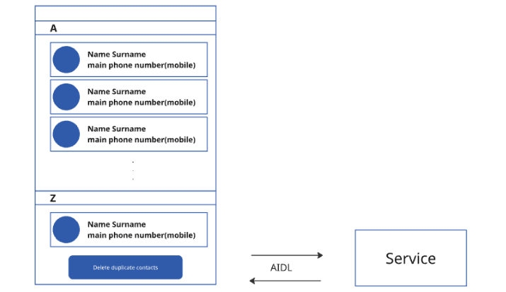

Тестовое задание от команды kvadraOS_Apps___Services
Выполнил: Соловых Андрей

Вариант 3. Приложение для просмотра контактов с возможностью удалить
повторяющиеся

В задание не совсем точно указано , что означает "одинаково заполненные поля". Я добавил сравнение регистронезависимое и с нормализацией номера
Все пункты задания выполнены и проверены. Динамически добавленные контакты появляются и удаляются

UserStory1. Я, как пользователь, хочу видеть список контактов своего устройства
Описание:
Разработать приложение, которое будет отображать данные о контактах, сохраненных на
устройстве в виде списка, пункты которого отображают краткую информацию о каждом
контакте.
Критерии приемки:
• в списке должны отображаться только контакты хранящиеся на устройстве
• пользователь может видеть краткую информацию о каждом контакте в соотвествии с
требованиями

UserStory2. Я, как пользователь, хочу иметь возможность удалять повторяющиеся контакты с
устройства.
Описание:
Добавить в приложение Контакты возможность искать и удалять повторяющиеся контакты с
устройства. Все операции с контактами должны быть реализованы внутри отдельного
сервиса, который взаимодействует с приложением через AIDL.
После завершения операции пользователь должен быть проинформирован о статусе
операции:
- повторяющиеся контакты удалены успешно
- произошла ошибка
- повторяющиеся контакты не найдены
  
Критерии приемки:
  • Пользователь может начать процесс удаления повторяющихся контактов по нажатию
  на кнопку «Удалить одинаковые контакты» («Delete duplicate contacts»)
  • Сервис находит и удаляет повторяющиеся контакты на устройстве
  • Сервис сообщает приложению, что удаление дублей контактов завершено
  • Список контактов в приложении обновляется и не отображает одинаковые контакты
 
 Требования:Повторяющимися контактами считаются контакты имеющие полностью
  одинаково заполненные поля. Только такие контакты должны быть удалены.

